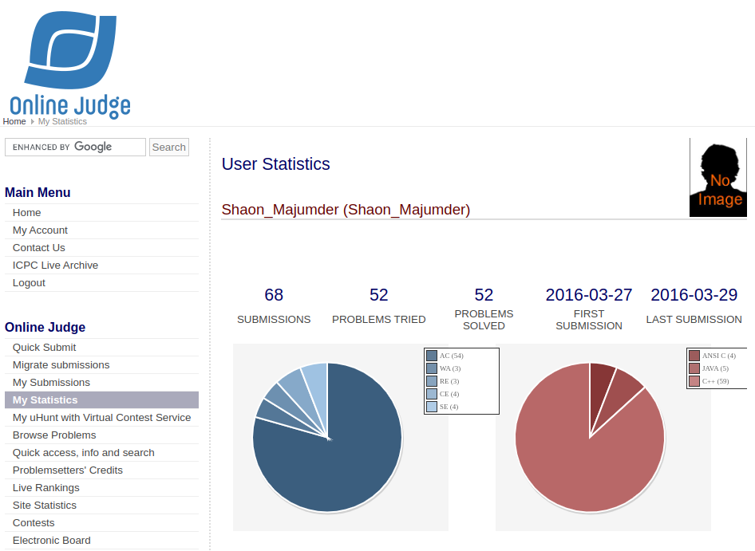

### Hi there 👋

I’m ✨ **Shaon Majumder** ✨

**Senior Software Engineer / Engineering Manager / High-Scale Backend Architect (200M+ Users)**  
**System Design · AI Platforms · Scalable APIs & Microservices**

Currently working as **Engineering Manager** at **[ClarioScope AI](https://clarioscope.ai/)**, building:

- **HIPAA-compliant AI healthcare platforms**
- **MCP-powered AI agents** that automate SaaS workflows
- **Scalable backends** and microservices for high-traffic, production systems

I love working on **AI + scalability**, **clean architecture**, and **developer experience**.

> 📚 Want to see how I think and code?  
> 👉 **[Learn from me — dev notes, patterns, and snippets](https://github.com/ShaonMajumder/development_notes)**

---

## 👨‍💻 About Me

- 🧠 **Engineer & Architect** – designing **scalable APIs**, **microservices**, and **AI-powered products**.
- 🚀 **Leader** – have served as **Engineering Manager**, **CTO**, and **Founder**, mentoring teams and shipping products end-to-end.
- 🤖 **Robotics & IoT background** – 5+ years as a robotics startup founder (drones, automation, IoT dashboards).
- 🌍 **Lifelong learner** – love exploring new domains: healthcare, telecom, fintech, logistics, garments, ecommerce & more.

<!-- Here are some ideas to get you started: -->
<!-- - 🔭 I’m currently working on ... -->
<!-- - 🌱 I’m currently learning ... -->
<!-- - 👯 I’m looking to collaborate on Open Source Projects -->
<!-- - 🤔 I’m looking for help with ... -->
<!-- - 💬 Ask me about ... -->
<!-- - 📫 How to reach me: ... -->
<!-- - 😄 Pronouns: ... -->
<!-- - ⚡ Fun fact: ... -->

<!-- 
 -->

### Languages and Tools:

[][webdevplaylist]
[][webdevplaylist]
[][webdevplaylist]
[][webdevplaylist]
[][webdevplaylist]
[][webdevplaylist]
[][webdevplaylist]
[][webdevplaylist]
[][webdevplaylist]

[][webdevplaylist]
[][webdevplaylist]
[][cssplaylist]
[][cssplaylist]
[][jsplaylist]

<!-- [][reactplaylist] -->
<!-- [][webdevplaylist] -->
<!-- [][webdevplaylist] -->

[][webdevplaylist]

<!-- [][webdevplaylist] -->

[][webdevplaylist]
[][webdevplaylist]

<!-- [][webdevplaylist] -->

[][webdevplaylist]
[][webdevplaylist]
[][webdevplaylist]

 
 

### 📺 Open Source Development

#### Package Development

- [PIP Python](https://pypi.org/user/shaonmajumder)
- [Composer Php Laravel](https://packagist.org/packages/shaonmajumder)
- [NPM JS](https://www.npmjs.com/~shaonmajumder)

### 🧩 Problem Solving Profiles

#### LeetCode

#### Hackerrank

#### UVA Online Judge

### My GitHub Stats

---

### 📺 Skill Projects

- [PenOS-RT](https://github.com/shaonmajumder/PenOS-RT)
- [JobGenie.ai](https://github.com/shaonmajumder/JobGenie.ai)
- [ScreenTime](https://github.com/shaonmajumder/ScreenTime)
- [VisionSense.ai](https://github.com/shaonmajumder/VisionSense.ai)
- [linklens.ai](https://github.com/shaonmajumder/linklens.ai)
- [medicine.ai](https://github.com/shaonmajumder/medicine.ai)
- [video-chat](https://github.com/shaonmajumder/video-chat)
- [google-sheet-sync](https://github.com/shaonmajumder/google-sheet-sync)
- [online-judge](https://github.com/shaonmajumder/online-judge)
- [SyncHR](https://github.com/shaonmajumder/SyncHR)
- [booking-platform](https://github.com/shaonmajumder/booking-platform)
- [MLTube](https://github.com/shaonmajumder/MLTube)
- [hackerrank-card](https://github.com/shaonmajumder/hackerrank-card)
- [AssetFlow](https://github.com/shaonmajumder/AssetFlow)
- [ShreyaTravels](https://github.com/shaonmajumder/ShreyaTravels)
---
### 📕 Latest Blog Posts

➡️ [more blog posts...](https://shaonmajumder.medium.com)

---

### 📺 Latest YouTube Videos

<!-- YOUTUBE:START -->

- [Fast Laravel App Challenge Live](https://www.youtube.com/watch?v=5w9zOjqZg_I)
- [Industrial Robotics | RIFID based restaurant management System| via Conveyor Belt Drive | Phase 3](https://www.youtube.com/watch?v=mG3S9V09oz4)
- [How to make Thumbnail for YouTube With Photoshop | Easy & Free | (বাংলা)](https://www.youtube.com/watch?v=oME7xg-xJo4)
- [AI Object Detection, Place: Dhaka | YOLO | Deep Learning | Artificial Intelligence Demo](https://www.youtube.com/watch?v=aQ1HHXJjG6o)
- [Real-time Object detection using Deep Learning Featuring Rokomari.com Old Software Room](https://www.youtube.com/watch?v=5Nj3ARSmmpc)
<!-- YOUTUBE:END -->

➡️ [more videos...](https://youtube.com/ShaonMajumder)

---

### Connect with me:

[][website]
[][youtube]
[][twitter]
[][linkedin]
[][instagram]

 

---

[website]: https://robist.com
[twitter]: https://twitter.com/TheShaonShow
[youtube]: https://youtube.com/ShaonMajumder
[instagram]: https://instagram.com/shaon.majumder
[linkedin]: https://linkedin.com/in/ShaonMajumder
[webdevplaylist]: https://www.youtube.com/playlist?list=PLkwxH9e_vrAJ0WbEsFA9W3I1W-g_BTsbt
[jsplaylist]: https://www.youtube.com/playlist?list=PLkwxH9e_vrALRJKu7wfXby3MKeflhTu6B
[cssplaylist]: https://www.youtube.com/playlist?list=PLkwxH9e_vrALSdvZuEh6gqQdmDoDIoqz4
[reactplaylist]: https://www.youtube.com/playlist?list=PLkwxH9e_vrAK4TdffpxKY3QGyHCpxFcQ0
